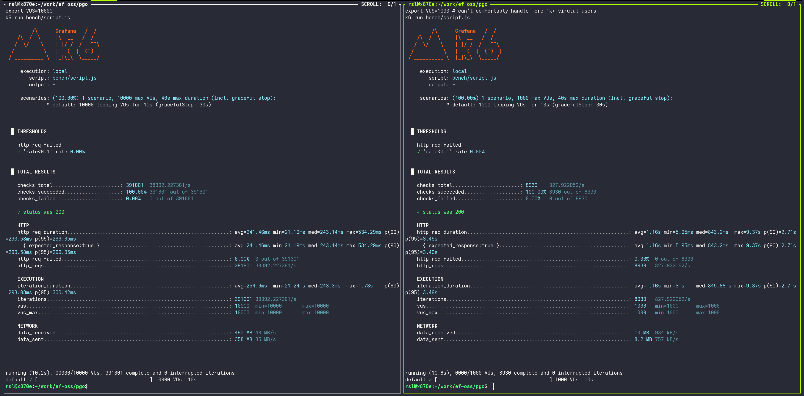

# pgo (`/pɪɡəʊ/`): Postgres integrations in Go

> **usability status: experimental**

This project follows a **Work → Right → Fast** approach:

1. make it work
2. refine it
3. optimize it

It's in the early stage, so the code may be rough/incomplete. Join us in building and improving it!

```sh
go install github.com/edgeflare/pgo@main # or make build or download from release page
```

## [PostgREST](https://docs.postgrest.org/en/stable/references/api/tables_views.html) compatible REST API

```sh
pgo rest --config pkg/config/example.config.yaml
```

See [godoc](https://pkg.go.dev/github.com/edgeflare/pgo/pkg/rest) and `pgo rest --help` for more.

[Benchmark results](./bench) compared to PostgREST

| Metric | PGO REST | PostgREST |
|--------|---------------|-----------|
| VUs | 10,000 | 1,000 |
| Requests/sec | 38,392 | 828 |
| Avg Response Time | 241ms | 1.16s |
| P95 Response Time | 299ms | 3.49s |
| Error Rate | 0% | 0% |



## Stream Postgres changes to NATS, MQTT, Kafka, Clickhouse, etc

[](https://asciinema.org/a/704523)

1. Start Postgres, NATS, Kafka, MQTT broker and pgo pipeline as containers

```sh
git clone git@github.com:edgeflare/pgo.git

make image

# Set KAFKA_CFG_ADVERTISED_LISTENERS env var in docs/docker-compose.yaml to host IP for local access,
# as opposed to from within container network. adjust Kafka brokers IP in docs/pipeline-example.docker.yaml
make up # docker compose up
```

2. Postgres
- As a source: Create a test table, eg `users` in source postgres database

```sh
PGUSER=postgres PGPASSWORD=secret PGHOST=localhost PGDATABASE=testdb psql
```

```sql
CREATE TABLE IF NOT EXISTS public.users (
  id INT GENERATED BY DEFAULT AS IDENTITY PRIMARY KEY,
  name TEXT
);

ALTER TABLE public.users REPLICA IDENTITY FULL;
```

- As a sink

```sh
PGUSER=postgres PGPASSWORD=secret PGHOST=localhost PGDATABASE=testdb PGPORT=5431 psql
```

- Create the same users table in sink database for mirroring. altering replica identity may not be needed in sink

- Create a second table in sink database which stores **transformed** data 

```sql
CREATE SCHEMA IF NOT EXISTS another_schema;

CREATE TABLE IF NOT EXISTS  another_schema.transformed_users (
  uuid UUID DEFAULT gen_random_uuid(), -- because we're extracting only `name` field
  -- new_id INT GENERATED BY DEFAULT AS IDENTITY PRIMARY KEY, -- to handle UPDATE operations, primary key column type must match in source and sink
  new_name TEXT
);
```

pgo caches the table schemas for simpler parsing of CDC events (rows). To update pgo cache with newly created tables,
either `docker restart pgo_pgo_1` or `NOTIFY` it to reload cache by executing on database

```sql
NOTIFY pgo, 'reload schema';
```

4. Subscribe

- MQTT: `/any/prefix/schemaName/tableName/operation` topic (testing with mosquitto client)

```sh
mosquitto_sub -t pgo/public/users/c # operation: c=create, u=update, d=delete, r=read
```

- Kafka: topic convention is `[prefix].[schema_name].[table_name].[operation]`. use any kafka client eg [`kaf`](https://github.com/birdayz/kaf)

```sh
kaf consume pgo.public.users.c --follow # consume messages until program execution
```

- NATS:

```sh
nats sub -s nats://localhost:4222 'pgo.public.users.>' # wildcard. includes all nested parts
# nats sub -s nats://localhost:4222 'pgo.public.users.c' # specific
```

5. `INSERT` (or update etc) into users table

```sql
INSERT INTO users (name) VALUES ('alice');
INSERT INTO users (name) VALUES ('bob');
```

And notice NATS, MQTT, Kafka, postgres-sink, or debug peer's respective subscriber receiving the message.
It's not Postgres only source. Other peers too can be sources (not all peers fully functional yet).


Clean up

```sh
make down
```

It's also possible to import functions, etc around
- net/http.Handler
  - router
  - middleware (authentication, logging, CORS, RequestID, ...)
  - Postgres middleware attaches a pgxpool.Conn to request context for authorized user; useful for RLS

If you're curious, start by browsing the [examples](./examples/), skimming over any doc.go, *.md files.

## Contributing
Please see [CONTRIBUTING.md](CONTRIBUTING.md).

## License
Apache License 2.0
