# Retrieval-Augmented Generation (RAG) on PostgreSQL with PGVector

Retrieval-Augmented Generation (RAG) is a technique that combines the strengths of large language models (LLMs) with up-to-date, private, internal information to provide more accurate, contextually relevant responses. It works by:

1. Retrieving relevant information from a knowledge base in response to a query.
2. Augmenting the original query with this retrieved information (context).
3. Using a language model to generate a response based on both the query and the retrieved context.



## Key Concepts

1. **Embeddings**: Vector representations of texts or other data.
2. **Vector Database**: A database optimized for storing and querying vector embeddings (e.g., PostgreSQL with pgvector extension).
3. **(Semantic) Similarity Search**: Finding the most similar vectors to a given query vector.
4. **RAG (Retrieval-Augmented Generation)**: A technique that enhances language models by retrieving relevant information from a knowledge base.

## PGVector Basics

PGVector is a PostgreSQL extension that adds support for vector operations and similarity search, enabling efficient storage and querying of embeddings.

### Data Type
- `vector(n)`: Represents an n-dimensional vector.

### Similarity Functions
- `<->`: Euclidean distance
- `<#>`: Negative inner product
- `<=>`: Cosine distance

### Creating a Table with Vector Column

```sql
CREATE TABLE IF NOT EXISTS embeddings (
    id BIGINT PRIMARY KEY GENERATED BY DEFAULT AS IDENTITY,
    content TEXT,
    embedding vector(1536)
);
```

### Indexing

```sql
-- IVFFlat index (faster build, larger index)
CREATE INDEX ON documents USING ivfflat (embedding vector_l2_ops) WITH (lists = 100);
-- HNSW index (slower build, faster search)
CREATE INDEX ON documents USING hnsw (embedding vector_cosine_ops) WITH (m = 16, ef_construction = 64);
```

## RAG Implementation Steps

1. **Prepare Knowledge Base**:
   - Collect and preprocess documents
   - Generate embeddings for documents
   - Store documents and embeddings in the vector database

2. **Query Processing**:
   - Generate embedding for the user query
   - Perform similarity search to retrieve relevant documents

3. **Context Augmentation**:
   - Combine retrieved documents with the original query

4. **Generation**:
   - Feed the augmented context to the language model
   - Generate the response

## Best Practices

1. Choose appropriate embedding dimensions (usually 768, 1536, 3072 for modern models).
2. Experiment with different indexing methods for optimal performance.
3. Use batching for efficient embedding generation and database operations.
4. Implement caching mechanisms to reduce redundant computations.
5. Regularly update and maintain your knowledge base for accurate retrievals.

## Useful PGVector Functions

- `vector_dims(vector)`: Returns the dimension of a vector
- `vector_norm(vector)`: Calculates the Euclidean norm of a vector
- `vector_add(vector, vector)`: Adds two vectors
- `vector_subtract(vector, vector)`: Subtracts one vector from another

See implementation [examples/rag/main.go](../examples/rag/main.go).
